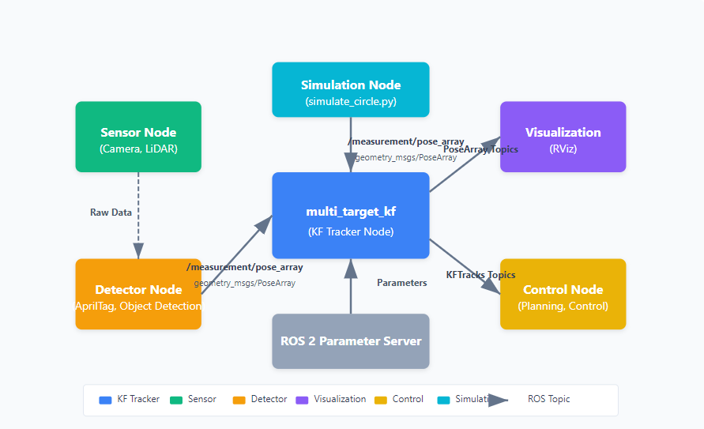

# ROS2 Package for Multi-Target Tracking using Kalman Filters

## Overview


The `multi_target_kf` package is a ROS 2 implementation of Kalman filters for multi-target state estimation. The package supports multiple motion models and provides a framework for tracking multiple targets simultaneously. It uses the Hungarian algorithm for measurement-to-track association and implements a modular design that allows for easy extension with new motion models.




## Table of Contents

- [Installation](#installation)
- [Package Structure](#package-structure)
- [Motion Models](#motion-models)
  - [Available Models](#available-models)
  - [Model Parameters](#model-parameters)
- [Usage](#usage)
  - [Configuration](#configuration)
  - [Launch Files](#launch-files)
  - [ROS Topics](#ros-topics)
- [Examples](#examples)
- [Extending the Package](#extending-the-package)
- [Testing](#testing)

## Installation

### Dependencies

- Eigen3
- ROS 2 (humble or later)
- Standard ROS 2 packages: `std_msgs`, `geometry_msgs`, `sensor_msgs`

### Building from Source

```bash
# Create a workspace (if you don't have one already)
mkdir -p ~/ros2_ws/src
cd ~/ros2_ws/src

# Clone the repository
git clone https://github.com/mzahana/multi_target_kf.git

# Install dependencies
cd ~/ros2_ws
rosdep install --from-paths src --ignore-src -r -y

# Build the package
colcon build --packages-select multi_target_kf

# Source the workspace
source ~/ros2_ws/install/setup.bash
```

## Package Structure

The package follows a modular design pattern centered around the following key components:

- **Motion Models**: Implement different kinematic behaviors (e.g., constant velocity, constant acceleration)
- **KF Tracker**: Core implementation of the Kalman filter with multi-target tracking capabilities
- **ROS Interface**: Bridges between ROS and the KF tracker implementation
- **Hungarian Algorithm**: Used for optimal assignment between tracks and measurements

The directory structure is as follows:

```
multi_target_kf/
├── include/multi_target_kf/        # C++ header files
│   ├── constant_accel.h            # Constant acceleration model
│   ├── constant_vel.h              # Constant velocity model
│   ├── hungarian.h                 # Hungarian algorithm for assignment
│   ├── kf_tracker.h                # Core Kalman filter tracker
│   ├── model_factory.h             # Factory for creating motion models
│   ├── models.h                    # Collection of all models
│   ├── motion_model.h              # Base class for motion models
│   ├── structs.h                   # Data structure definitions
│   ├── tracker_config.h            # Configuration for the tracker
│   └── tracker_ros.h               # ROS interface
├── src/                            # C++ implementation files
│   ├── hungarian.cpp               # Hungarian algorithm implementation
│   ├── kf_tracker.cpp              # Tracker implementation
│   ├── tracker_node.cpp            # ROS node entry point
│   └── tracker_ros.cpp             # ROS interface implementation
├── config/                         # Configuration files
│   ├── kf_param.yaml               # General parameters
│   ├── kf_param_accel.yaml         # Constant acceleration parameters
│   ├── kf_param_vel.yaml           # Constant velocity parameters
│   └── tracker_visualization.rviz   # RViz configuration
├── launch/                         # Launch files
│   ├── kf_const_accel.launch.py    # Launch with constant acceleration model
│   ├── kf_const_vel.launch.py      # Launch with constant velocity model
│   ├── kf_rviz.launch.py           # Launch with RViz visualization
│   └── modular_kf.launch.py        # Modular launch with configurable parameters
├── msg/                            # Custom ROS messages
│   ├── KFTrack.msg                 # Single track message
│   └── KFTracks.msg                # Multiple tracks message
├── scripts/                        # Python scripts
│   └── simulate_circle.py          # Simulation script for testing
└── test/                           # Unit tests
    └── test_motion_models.cpp      # Tests for motion models
```

## Motion Models

### Available Models

The package currently provides these motion models:

1. **Constant Velocity Model (CONSTANT_VELOCITY)**
   - State vector: `[px, py, pz, vx, vy, vz]`
   - Assumes targets move with constant velocity
   - Process noise is modeled as random accelerations

2. **Constant Acceleration Model (CONSTANT_ACCELERATION)**
   - State vector: `[px, py, pz, vx, vy, vz, ax, ay, az]`
   - Assumes targets move with constant acceleration
   - Process noise is modeled as random jerks

3. **Adaptive Acceleration UKF Model (ADAPTIVE_ACCEL_UKF)**
   - State vector: `[px, py, pz, vx, vy, vz, ax, ay, az]`
   - Uses Unscented Kalman Filter for nonlinear state estimation
   - Features adaptive process noise that increases during maneuvers
   - Ideal for tracking agile targets with frequent trajectory changes

All models use a measurement vector `[px, py, pz]` which represents 3D position measurements.

### Model Parameters

#### Common Parameters

- `dt_pred`: Prediction time step (seconds)
- `V_max`: Maximum uncertainty before rejecting a track (m³)
- `V_certain`: Minimum uncertainty for confirming a track (m³)
- `N_meas`: Minimum number of measurements to confirm a track
- `l_threshold`: Measurement association log-likelihood threshold
- `dist_threshold`: Maximum distance between a state & measurement for association
- `r_diag`: Diagonal elements of measurement noise covariance matrix R
- `sigma_p`: Standard deviation of position for initial state covariance

#### Constant Velocity Model Parameters

- `sigma_a`: Standard deviation of acceleration noise
- `sigma_v`: Standard deviation of velocity for initial state covariance

#### Constant Acceleration Model Parameters

- `sigma_j`: Standard deviation of jerk noise
- `sigma_v`: Standard deviation of velocity for initial state covariance
- `sigma_a`: Standard deviation of acceleration for initial state covariance

#### Adaptive Acceleration UKF Model Parameters

- `alpha`: Controls spread of sigma points (default: 0.3)
- `beta`: Distribution parameter (2.0 optimal for Gaussian distributions)
- `kappa`: Secondary scaling parameter (usually 0)
- `jerk_std`: Base jerk noise standard deviation
- `jerk_adaptive_max`: Maximum adaptive jerk during maneuvers
- `adaptive_threshold`: Threshold for maneuver detection
- `adaptive_decay`: Rate of return to nominal noise levels
- `innovation_window_size`: Window size for maneuver detection
- `sigma_v`: Standard deviation of velocity for initial state covariance
- `sigma_a`: Standard deviation of acceleration for initial state covariance

## Usage

### Configuration

The package can be configured through YAML parameter files. Example configurations are provided in the `config/` directory:

- `kf_param_vel.yaml`: Configuration for the constant velocity model
- `kf_param_accel.yaml`: Configuration for the constant acceleration model
- `kf_param_ukf.yaml`: Configuration for the UKF with constant acceleration model and adaptive noise 

### Launch Files

The package provides several launch files:

1. **kf_const_vel.launch.py**: Launch the tracker with a constant velocity model
   ```bash
   ros2 launch multi_target_kf kf_const_vel.launch.py
   ```

2. **kf_const_accel.launch.py**: Launch the tracker with a constant acceleration model
   ```bash
   ros2 launch multi_target_kf kf_const_accel.launch.py
   ```

3. **kf_const_ukf.launch.py**: Launch the UKF tracker with a constant acceleration model and adaptive noise
   ```bash
   ros2 launch multi_target_kf kf_const_ukf.launch.py
   ```

4. **kf_rviz.launch.py**: Launch the tracker with RViz visualization
   ```bash
   ros2 launch multi_target_kf kf_rviz.launch.py
   ```


5. **modular_kf.launch.py**: Launch with configurable parameters
   ```bash
   # Example: Launch with custom parameters
   ros2 launch multi_target_kf modular_kf.launch.py model_type:=1 detections_topic:=my_measurements
   ```

### ROS Topics

#### Subscribed Topics

- `/measurement/pose_array` (`geometry_msgs/PoseArray`): Input measurements for the tracker

#### Published Topics

- `/kf/good_tracks_pose_array` (`geometry_msgs/PoseArray`): Filtered track positions (certain tracks only)
- `/kf/all_tracks_pose_array` (`geometry_msgs/PoseArray`): All track positions
- `/kf/good_tracks` (`multi_target_kf/KFTracks`): Detailed information about certain tracks
- `/kf/all_tracks` (`multi_target_kf/KFTracks`): Detailed information about all tracks

#### Custom Messages

- `KFTrack.msg`: Single track information including position, velocity, acceleration (when applicable), and covariance
- `KFTracks.msg`: Array of `KFTrack` messages with a header

## Examples

### Basic Usage

Here's a basic example of how to use the package:

1. Launch the Kalman filter tracker with RViz visualization:
   ```bash
   ros2 launch multi_target_kf kf_rviz.launch.py
   ```
   It also runs simulation node that generates synthetic measurements with some noise

2. You should see the tracks being visualized in RViz, with red arrows representing all tracks and green arrows representing certain tracks.

### Custom Parameter Configuration

To use custom parameters:

1. Create a custom YAML file (or copy and modify an existing one):
   ```bash
   cp ~/ros2_ws/src/multi_target_kf/config/kf_param_vel.yaml ~/my_params.yaml
   # Edit ~/my_params.yaml to adjust parameters as needed
   ```

2. Launch the tracker with your custom parameters:
   ```bash
   ros2 launch multi_target_kf modular_kf.launch.py kf_yaml:=~/my_params.yaml
   ```

### Example: AdaptiveAccelUKF Model

An example of a more complex model is the `AdaptiveAccelUKF` model which implements an Unscented Kalman Filter with adaptive process noise. The model enhances tracking of maneuvering targets by:

1. Using sigma points to capture nonlinear state transitions
2. Detecting maneuvers through innovation monitoring
3. Adaptively adjusting process noise during aggressive maneuvers

To use this model:

```bash
ros2 launch multi_target_kf kf_const_ukf.launch.py
```

Or with RViz visualization:

```bash
ros2 launch multi_target_kf kf_rviz.launch.py model_type:=2
```

Key parameters for the UKF model include:

- `alpha`: Controls spread of sigma points (default: 0.3)
- `beta`: Prior knowledge of distribution (2.0 for Gaussian distributions)
- `kappa`: Secondary scaling parameter (usually 0)
- `jerk_std`: Base jerk noise standard deviation
- `jerk_adaptive_max`: Maximum adaptive jerk during maneuvers
- `adaptive_threshold`: Threshold for maneuver detection
- `adaptive_decay`: Rate of return to nominal noise levels

These parameters can be tuned in the config file or set at runtime using ROS parameters.

## Extending the Package

### Creating a New Motion Model

The `multi_target_kf` package is designed to be easily extensible with new motion models. Below is a comprehensive guide on how to add your own custom motion model to the package.

#### Step 1: Create the Motion Model Header File

First, create a new header file in the `include/multi_target_kf/` directory for your motion model. The model must inherit from the `MotionModel` base class and implement all required virtual methods.

Example structure for a new model (`my_new_model.h`):

```cpp
// include/multi_target_kf/my_new_model.h
#ifndef MY_NEW_MODEL_H
#define MY_NEW_MODEL_H

#include "multi_target_kf/motion_model.h"
#include <vector>

class MyNewModel : public MotionModel {
private:
    // Model-specific parameters and member variables
    double param1_, param2_;
    
    // For more complex models like UKF, additional internal structures
    std::vector<double> internal_weights_;
    Eigen::MatrixXd sigma_points_;

public:
    /* Constructor */
    MyNewModel() : param1_(0.0), param2_(0.0) {
        NUM_STATES = 9;        // Set the size of your state vector
        NUM_MEASUREMENTS = 3;  // Usually 3 for position measurements
        init();
        
        // Initialize model-specific structures
        initializeInternalStructures();
    }
    
    ~MyNewModel() override {}

    // Required overrides from MotionModel base class
    bool init() override;
    Eigen::VectorXd f(Eigen::VectorXd x, double dt) override;
    Eigen::VectorXd h(Eigen::VectorXd x) override;
    Eigen::MatrixXd F(double dt) override;
    bool F(Eigen::MatrixXd M) override;
    Eigen::MatrixXd H() override;
    bool H(Eigen::MatrixXd M) override;
    Eigen::MatrixXd Q(double dt) override;
    bool Q(Eigen::MatrixXd M) override;
    bool Q(std::vector<double> v) override;
    Eigen::MatrixXd R() override;
    bool R(Eigen::MatrixXd M) override;
    bool R(std::vector<double> v) override;
    Eigen::MatrixXd P() override;
    bool P(Eigen::MatrixXd M) override;
    kf_state predictX(kf_state s, double dt) override;
    kf_state updateX(sensor_measurement z, kf_state s) override;
    double logLikelihood(kf_state xx, sensor_measurement z) override;
    kf_state initStateFromMeasurements(sensor_measurement z) override;
    double computeDistance(kf_state xx, sensor_measurement zz) override;
    
    // Model-specific methods
    void initializeInternalStructures();
    bool setParam1(double p);
    bool setParam2(double p);
    
    // Add any other model-specific methods you need
};

#endif // MY_NEW_MODEL_H
```

Implement all the required methods in the header file. For an example of a complete implementation, refer to the existing models like `constant_vel.h`, `constant_accel.h`, or the more complex `adaptive_accel_ukf.h`.

#### Step 2: Update the ModelType Enum

Add your new model type to the `ModelType` enum in `include/multi_target_kf/model_factory.h`:

```cpp
// include/multi_target_kf/model_factory.h
enum ModelType {
    CONSTANT_VELOCITY = 0,
    CONSTANT_ACCELERATION = 1,
    ADAPTIVE_ACCEL_UKF = 2,
    MY_NEW_MODEL = 3,  // Add your new model type here
};
```

#### Step 3: Include Your Model Header

Add an include statement for your new model header in `model_factory.h`:

```cpp
// include/multi_target_kf/model_factory.h
#include "multi_target_kf/motion_model.h"
#include "multi_target_kf/constant_vel.h"
#include "multi_target_kf/constant_accel.h"
#include "multi_target_kf/adaptive_accel_ukf.h"
#include "multi_target_kf/my_new_model.h"  // Add this include
```

#### Step 4: Register Your Model in the ModelFactory

Update the factory methods in `model_factory.h` to create instances of your model:

```cpp
// In the ModelFactory class:
static MotionModel* createModel(ModelType type) {
    switch (type) {
        case CONSTANT_VELOCITY:
            return new ConstantVelModel();
        case CONSTANT_ACCELERATION:
            return new ConstantAccelModel();
        case ADAPTIVE_ACCEL_UKF:
            return new AdaptiveAccelUKF();
        case MY_NEW_MODEL:  // Add your new case
            return new MyNewModel();
        default:
            return nullptr;
    }
}

static const char* getModelName(ModelType type) {
    switch (type) {
        case CONSTANT_VELOCITY:
            return "Constant Velocity";
        case CONSTANT_ACCELERATION:
            return "Constant Acceleration";
        case ADAPTIVE_ACCEL_UKF:
            return "Adaptive Acceleration UKF";
        case MY_NEW_MODEL:  // Add your new case
            return "My New Model";
        default:
            return "Unknown Model";
    }
}
```

#### Step 5: Update the TrackerConfig Structure

Modify the `TrackerConfig` structure in `include/multi_target_kf/tracker_config.h` to include any model-specific parameters your model needs:

```cpp
// include/multi_target_kf/tracker_config.h
struct TrackerConfig {
    // Existing parameters...
    
    // Parameters for your new model
    double my_param1;
    double my_param2;
    
    // In the constructor, initialize with default values
    TrackerConfig() :
        // Existing initializations...
        my_param1(1.0),
        my_param2(2.0)
    {}
    
    // Update the print method if needed
    void print() const {
        // Existing code...
        if (model_type == MY_NEW_MODEL) {
            printf("- My Param 1: %f\n", my_param1);
            printf("- My Param 2: %f\n", my_param2);
        }
    }
};
```

#### Step 6: Update the KFTracker Implementation

Modify the `initKF` method in `src/kf_tracker.cpp` to initialize your model:

```cpp
// In src/kf_tracker.cpp

bool KFTracker::initKF(void)
{
    // Existing code...
    
    // Model-specific initialization
    if (config_.model_type == CONSTANT_VELOCITY) {
        // Existing constant velocity initialization...
    }
    else if (config_.model_type == CONSTANT_ACCELERATION) {
        // Existing constant acceleration initialization...
    }
    else if (config_.model_type == ADAPTIVE_ACCEL_UKF) {
        // Existing UKF initialization...
    }
    else if (config_.model_type == MY_NEW_MODEL) {
        // Cast to your model type for model-specific initialization
        MyNewModel* model = static_cast<MyNewModel*>(kf_model_);
        
        // Set model-specific parameters
        if (!model->setParam1(config_.my_param1)) return false;
        if (!model->setParam2(config_.my_param2)) return false;
        
        // Set initial state parameters (if applicable)
        if (!model->setSigmaP(config_.sigma_p)) return false;
        
        // Setup initial matrices
        if (!model->Q(q_diag_)) return false;
        if (!model->R(r_diag_)) return false;
    }
    
    // Existing code...
}
```

#### Step 7: Update TrackerROS for Parameter Loading

Modify the `loadParameters` method in `src/tracker_ros.cpp` to load your model's parameters:

```cpp
// In src/tracker_ros.cpp

void TrackerROS::loadParameters()
{
    // Existing code...
    
    // Parameters for your model
    this->declare_parameter("my_param1", config_.my_param1);
    config_.my_param1 = this->get_parameter("my_param1").get_parameter_value().get<double>();
    
    this->declare_parameter("my_param2", config_.my_param2);
    config_.my_param2 = this->get_parameter("my_param2").get_parameter_value().get<double>();
    
    // Existing code...
    
    if (config_.debug) {
        // Existing debug output...
        
        // Add model parameter logging if using your model
        if (config_.model_type == MY_NEW_MODEL) {
            RCLCPP_INFO(this->get_logger(), "  my_param1: %f", config_.my_param1);
            RCLCPP_INFO(this->get_logger(), "  my_param2: %f", config_.my_param2);
        }
    }
}
```

Also update the `paramsTimerCallback` method to handle dynamic updates of your model's parameters:

```cpp
// In src/tracker_ros.cpp

void TrackerROS::paramsTimerCallback()
{
    // Existing code...
    
    // Update your model parameters if using that model
    if (config_.model_type == MY_NEW_MODEL) {
        MyNewModel* model = static_cast<MyNewModel*>(kf_tracker_->kf_model_);
        
        // Check if any parameters have changed
        double my_param1 = this->get_parameter("my_param1").as_double();
        if (my_param1 != config_.my_param1) {
            config_.my_param1 = my_param1;
            model->setParam1(my_param1);
        }
        
        double my_param2 = this->get_parameter("my_param2").as_double();
        if (my_param2 != config_.my_param2) {
            config_.my_param2 = my_param2;
            model->setParam2(my_param2);
        }
    }
    
    // Existing code...
}
```

#### Step 8: Create a Configuration File

Create a configuration YAML file for your model in the `config/` directory:

```yaml
# config/kf_param_my_model.yaml
/kf_tracker_node:
  ros__parameters:
    # Motion model selection: 3 = MY_NEW_MODEL
    model_type: 3
    
    # Rate of prediction step
    dt_pred: 0.02
    
    # Debugging
    print_debug_msg: False
    
    # Uncertainty thresholds
    V_max: 100.0          # Maximum uncertainty before rejecting a track [m^3]
    V_certain: 30.0       # Minimum uncertainty for confirming a track [m^3]
    
    # Track confirmation and filtering
    N_meas: 10                      # Minimum number of measurements to confirm a track
    l_threshold: -10.0              # Measurement association log-likelihood threshold
    dist_threshold: 5.0             # Maximum distance between a state & measurement to consider them as a match
    track_mesurement_timeout: 1.5   # Maximum time (seconds) from last measurement before considering a track uncertain
    
    # Your model's specific parameters
    my_param1: 1.0
    my_param2: 2.0
    
    # Common parameters
    sigma_p: 0.5     # Standard deviation of position (for initial state covariance)
    
    # Measurement covariance matrix R
    r_diag: [0.01, 0.01, 0.01]
    
    # Individual measurement covariance components (for convenience)
    r_diag_x: 0.01
    r_diag_y: 0.01
    r_diag_z: 0.01
    
    # Frame settings
    tracking_frame: 'observer/odom'  # Provide estimate w.r.t this frame
    target_frameid: 'tag'            # Frame name of the detected target
```

#### Step 9: Create a Launch File

Create a launch file for your model in the `launch/` directory:

```python
# launch/kf_my_model.launch.py
import os
from launch import LaunchDescription
from launch_ros.actions import Node
from ament_index_python.packages import get_package_share_directory
from launch.substitutions import LaunchConfiguration
from launch.actions import DeclareLaunchArgument

def generate_launch_description():
    # Add argument for the path of the yaml file
    kf_yaml = LaunchConfiguration('kf_yaml')
    detections_topic = LaunchConfiguration('detections_topic')
    namespace = LaunchConfiguration('kf_ns')
    model_type = LaunchConfiguration('model_type')

    # Default config for your model
    config = os.path.join(
        get_package_share_directory('multi_target_kf'),
        'config',
        'kf_param_my_model.yaml'
    )
    
    kf_yaml_launch_arg = DeclareLaunchArgument(
        'kf_yaml',
        default_value=config,
        description='Path to the YAML file with KF parameters'
    )

    detections_topic_launch_arg = DeclareLaunchArgument(
        'detections_topic',
        default_value='measurement/pose_array',
        description='Topic for incoming measurements'
    )

    namespace_launch_arg = DeclareLaunchArgument(
        'kf_ns',
        default_value='',
        description='Namespace for the KF node'
    )
    
    model_type_launch_arg = DeclareLaunchArgument(
        'model_type',
        default_value='3',  # 3 = MY_NEW_MODEL
        description='Motion model type: 0=CONSTANT_VELOCITY, 1=CONSTANT_ACCELERATION, 2=ADAPTIVE_ACCEL_UKF, 3=MY_NEW_MODEL'
    )

    # KF node
    kf_node = Node(
        package='multi_target_kf',
        executable='tracker_node',
        name='kf_tracker_node',
        namespace=namespace,
        output='screen',
        parameters=[
            kf_yaml,
            {'model_type': model_type}
        ],
        remappings=[('measurement/pose_array', detections_topic)]
    )

    ld = LaunchDescription()

    ld.add_action(kf_yaml_launch_arg)
    ld.add_action(detections_topic_launch_arg)
    ld.add_action(namespace_launch_arg)
    ld.add_action(model_type_launch_arg)
    ld.add_action(kf_node)

    return ld
```

#### Step 10: Update the Main README.md

Update the README.md to document your model, including:
- Description of the model
- State variables
- Model-specific parameters
- Any special considerations or usage tips

#### Step 11: Test Your Model

1. Build the package with your new model:
   ```bash
   cd ~/ros2_ws
   colcon build --packages-select multi_target_kf
   source ~/ros2_ws/install/setup.bash
   ```

2. Launch the tracker with your model:
   ```bash
   ros2 launch multi_target_kf kf_my_model.launch.py
   ```

3. Launch RViz for visualization:
   ```bash
   ros2 launch multi_target_kf kf_rviz.launch.py model_type:=3
   ```


## Testing

The package includes unit tests for the motion models. To run the tests:

```bash
cd ~/ros2_ws
colcon test --packages-select multi_target_kf
colcon test-result --verbose
```

You can also write your own tests for new motion models by following the examples in `test/test_motion_models.cpp`.